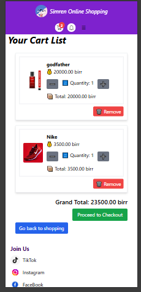
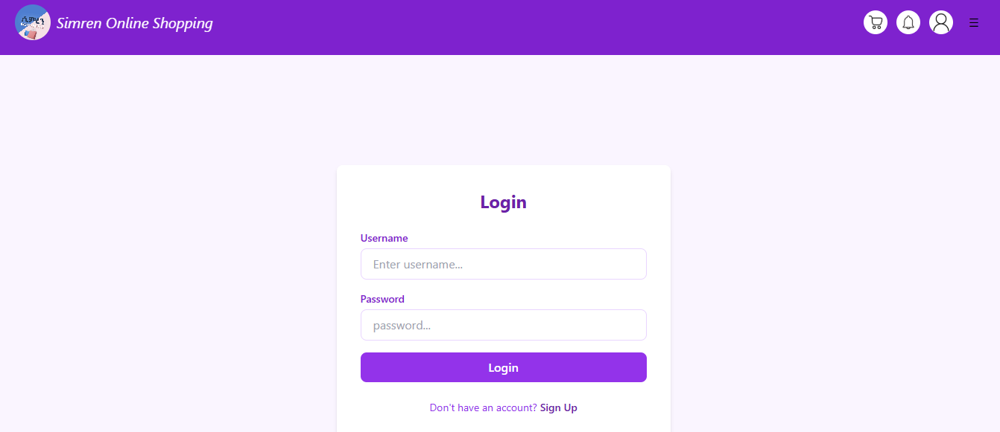
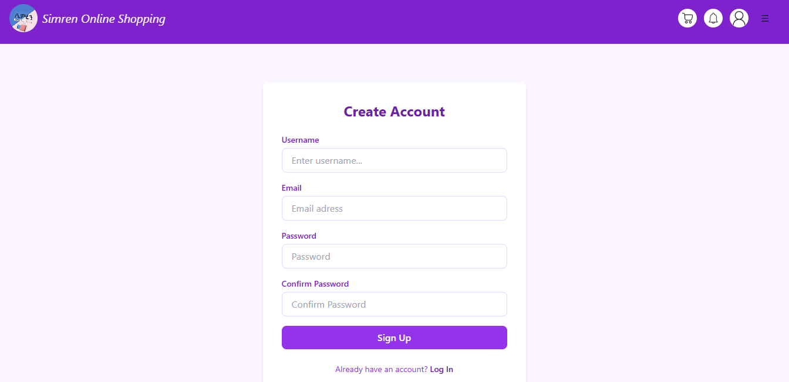

# Simren - Full-Stack E-Commerce Platform

A production-ready mini Amazon-like shopping platform with complete payment processing, real-time features, and multi-tier user management.

## 🚀 Live Demo
[View Live Site](https://simren.onrender.com)

## 📸 Screenshots

### 🏠 Homepage

### 🛒 Shopping Cart

### 💳 Payment System

### 📱 Responsive Dashboard

### 🧾 Digital Receipts

### 🔐 User Authentication

### 🎯 Product Management

## 🌟 Features

### 🛒 Core E-Commerce
- **Complete Cart System** - Add/remove items, quantity management
- **Chapa Payment Integration** - Real payment processing with REST API
- **Product Catalog** - Full CRUD operations for items
- **User Reviews & Ratings** - Frontend ready (backend in progress)

### 👥 Multi-Tier User System
1. **Super Admin** - Full CRUD operations, real-time notifications
2. **Authenticated Users** - Add to cart, purchase items, order history  
3. **Guest Users** - Browse products, real-time search

### ⚡ Advanced Features
- **Real-time Notifications** - HTMX/AJAX for instant purchase alerts
- **Live Search** - Dynamic product filtering
- **Downloadable Receipts** - PDF/invoice generation
- **Responsive UI** - Modern Tailwind CSS design
- **User Dashboards** - Personalized for each role

### 🛠️ Tech Stack
- **Backend**: Django, Python
- **Database**: Supabase (PostgreSQL)
- **Media Storage**: Cloudinary
- **Frontend**: HTML, Tailwind CSS, JavaScript
- **Real-time**: HTMX, AJAX
- **Payments**: Chapa API
- **Deployment**: Render
## 🏗️ Project Structure
simren/
├── core/ # Main app & templates
├── item/ # Product models & views
├── cart/ # Shopping cart functionality
├── dashboard/ # User dashboards
├── authentication/# User management
├── utility/ # Additional features
└── static/ # Tailwind CSS & assets

## 🚀 Quick Start

### Prerequisites
- Python 3.8+
- PostgreSQL (or Supabase)

### Installation
bash
# Clone repository
git clone https://github.com/yourusername/simren.git
cd simren

# Install dependencies
pip install -r requirements.txt

# Environment setup
cp .env.example .env
# Add your Cloudinary, Supabase, Chapa keys

# Run migrations
python manage.py migrate

# Start development server
python manage.py runserver

🔧 Configuration
Set these environment variables:

.env
DEBUG=True
CLOUD_NAME=your_cloudinary_cloud_name
API_KEY=your_cloudinary_api_key  
API_SECRET=your_cloudinary_api_secret
CHAPA_SECRET_KEY=your_chapa_secret_key
DB_NAME=your_database_name
DB_USER=your_database_user
DB_PASSWORD=your_database_password
DB_HOST=your_database_host
DB_PORT=your_database_port

📱 Usage

Super Admin: Manage products, view real-time sales

Registered Users: Browse, add to cart, checkout

Guests: Search and view products

🎯 What Makes This Special
It's a production-ready e-commerce platform with:

- Real payment processing 💳

- Scalable cloud architecture ☁️

- Professional user experience 🎨

- Enterprise-level features 🏢

🤝 Contributing
Open to contributions! Feel free to fork and submit PRs.

📄 License
MIT License - feel free to use this project as a template for your own e-commerce solutions!

Built by Merawi Yohannes a developer who's ready for opportunities!

- **Deployment**: Render

## 🏗️ Project Structu
